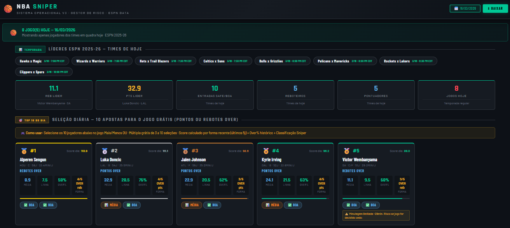
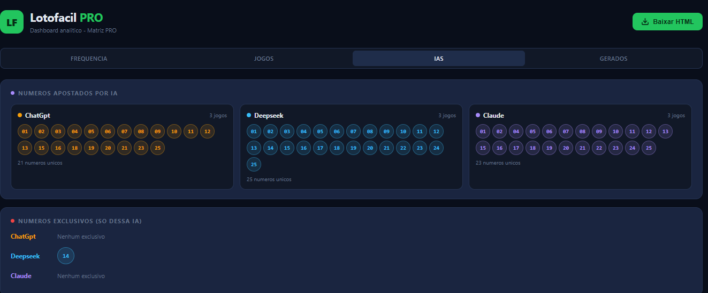

## 👋 About Me

### 🚢 Capacity Planner | 📊 Data Analytics | 🐍 Python Automation   
Turning shipping operations into data-driven decisions

Fala pessoal,

Hoje trabalho com **Capacity Planning e operações marítimas**, atuando diretamente com **bookings, alocação de carga, navios e análise de TEUs**.

Tenho uma base forte em operação no Comércio Exterior e estou evoluindo cada vez mais para **dados e automação aplicada no dia a dia**.

---

## ⚙️ O que eu faço hoje

* Planejamento de capacidade (TEU / weight / reefers)
* Análise de bookings (forecast vs actual)
* Ajustes operacionais (cut-off, rolagem, priorização)
* Suporte à tomada de decisão com dados

---

## 🧠 O que estou desenvolvendo

* 🐍 Automação com Python (relatórios, dashboards e rotinas operacionais)
* 📊 Power BI para análise e visualização de dados
* ⚙️ Scripts para reduzir trabalho manual
* 🚀 Projetos com foco em problema real de operação

## 📈 GitHub Activity

🚀 Projetos ativos e evolução constante

- 🔥 Automação com Python aplicada em logística
- 📊 Dashboards interativos (NBA & Lotofácil)
- 🚢 Projetos reais de shipping e capacity planning

💡 Foco: transformar operação em decisão baseada em dados

---

## 🚀 Projetos recentes

### 🏀 NBA Analytics (visível)

## 📊 Dashboard Preview

  

🚀 Live Demo: https://fabricionettto.github.io/Fabricionettto/
    
Sistema de análise de jogadores com geração automática de dashboard e insights baseados em dados reais.
→ baseado em dados, tendências e performance recente

📊 Dashboard: disponível via Live Demo acima

---

### 🎯 Lotofácil PRO (Data Driven)

## 📊 Dashboard Preview

  

🚀 Live Demo: https://fabricionettto.github.io/Lotofacil-data-driven/

→ leitura de frequência dos números  
→ identificação de padrões  

📊 Dashboard interativo com:

- números mais frequentes (quentes)
- números menos frequentes (frios)
- comparação entre estratégias

---

### 🚢 Shipping & Vessel Planning (em desenvolvimento)

Automação de processos de programação de navios, integração de dados e geração de relatórios operacionais.

⚠️ Projetos reais de operação — dados sensíveis não publicados
→ foco em automação, lógica de negócio e eficiência operacional

📄 Script base: 

---

## 🎯 Meu foco

Conectar **operação com tecnologia**.

Transformar problemas reais como:

* navio cheio
* falta de espaço
* ajuste de booking
* gestão de reefers

em **soluções automatizadas e inteligentes**.

---

## 🤝 Contato

Se você trabalha com:

* logística
* shipping
* dados
* automação

…ou quer trocar ideia sobre operação + tecnologia, me chama 👍

---

## 🛠️ Tech Stack

---

## 📈 Tech Stack & Focus

  

  
  
  

  

---

## 📊 GitHub Stats

